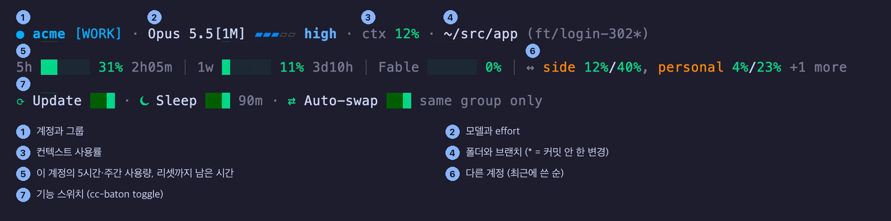

<div align="center">


# cc-baton

**내 Claude Code 계정끼리 대화를 옮깁니다. 트랜스크립트 전체 그대로.**

[](https://github.com/juunghyun/cc-baton/actions/workflows/ci.yml)
[](LICENSE)
[](#설치)

[English](README.md) | 한국어

</div>

팀 시트와 개인 요금제는 서로 다른 Claude 계정이고, 대화는 보통 시작한 계정에 묶여 있습니다. `/swap personal` 을 치고 Ctrl+D 를 누르면, 같은 대화가 트랜스크립트째로 다른 계정에서 이어집니다. statusline HUD 에서 지금 어느 계정인지 항상 보여서, 엉뚱한 계정에서 작업하는 일이 없습니다.


## 설치

```sh
command -v uv >/dev/null || { curl -LsSf https://astral.sh/uv/install.sh | sh && . "$HOME/.local/bin/env"; }
uv tool install --python 3.12 git+https://github.com/juunghyun/cc-baton@v0.1.2 && ~/.local/bin/cc-baton install
```

새 터미널을 열고 **`baton`** 을 실행하세요(zsh 함수이며, macOS 기본 셸이 zsh 입니다). 앞으로 Claude Code 는 `claude` 대신 `baton` 으로 여세요. 처음 실행하면 몇 가지(언어, 계정 그룹과 짧은 이름, HUD, 절전, 자동 스왑, 사용량 갱신, 권한 확인)를 묻고 계정 피커가 뜹니다. 계정은 함께 설치되는 [claude-swap](https://github.com/realiti4/claude-swap) 에 등록합니다. Claude Code 에 로그인한 상태에서 계정마다 `cswap add` 를 실행하세요. 계정이 하나여도 HUD 와 절전은 쓸 수 있습니다.

`cc-baton install` 은 아무것도 묻지 않고, 여러 번 돌려도 결과가 같습니다. `~/.claude/settings.json` 은 먼저 백업하고, 이미 쓰는 statusline 은 묻지 않고 바꾸지 않습니다.

<details>
<summary>AI 에이전트로 설치한다면</summary>

위 두 줄을 그대로 실행하세요. `~/.claude/settings.json` 과 `~/.zshrc` 는 직접 고치지 마세요. `cc-baton install` 이 출력한 내용을 사용자에게 보여 주고, 새 터미널에서 `baton` 을 실행해 설정을 마치라고 전하세요.

</details>

## 왜 cc-baton 인가

**요약이 아니라 대화 전체가 옮겨 갑니다.** 트랜스크립트 파일 자체를 다른 계정으로 복사해서 이어 갑니다. 큰 도구 출력과 서브에이전트 기록도 함께 옮겨 가고, 다른 대화는 원래 계정에 그대로 남습니다.

**지금 어느 계정인지 항상 압니다.** 입력창 아래 세 줄에 계정과 그룹, 계정마다의 사용량, 켜 둔 기능이 보입니다.



**엉뚱한 계정으로 넘기기 어렵습니다.** 계정에 `work`, `personal` 같은 그룹을 정해 두면, 그룹이 다른 계정으로 옮길 때 먼저 묻습니다.

**쉬는 탭이 메모리를 먹지 않습니다.** 선택 기능입니다. 오래 쉬는 세션은 Claude Code 프로세스를 멈춥니다(끝나지 않으면 강제 종료). 아무 키나 누르면 저장된 대화로 이어지고, 멈출 때 진행 중이던 작업은 잃을 수 있습니다. `/sleep` 은 바로 재웁니다.

**계정 하나를 다 쓰면 전환을 준비해 둡니다.** 선택 기능이고 기본은 꺼져 있습니다. 내 계정 하나가 사용 한도에 걸리면 다른 내 계정으로 전환을 준비하고, Ctrl+D 로 확정합니다.

## 명령

| 명령 | 하는 일 |
|---|---|
| `baton` | 계정을 골라 Claude Code 실행 (`baton work` 처럼 지정도 가능) |
| `/swap <계정>` | 이 대화를 다른 계정(번호, 짧은 이름, 이메일)으로 옮김, 그다음 Ctrl+D |
| `/sleep` | 이 세션을 지금 재우기 |
| `baton --wake` | 재운 세션 깨우기 |
| `cc-baton toggle update\|sleep\|autoswap\|usage\|bypass on\|off` | 기능 켜기·끄기 |
| `cc-baton setup` · `lang en\|ko` · `upgrade` | 설정 다시 · 화면 언어 · cc-baton 업데이트 |

Claude Code 는 `/swap` 을 "blocked by hook" 으로 표시합니다. 모델에 가기 전에 cc-baton 이 처리했다는 뜻이라 정상입니다. Ctrl+D 한 번에 안 닫히면 한 번 더 누르세요. 계정의 짧은 이름은 `cswap alias <번호> <이름>` 으로 언제든 바꿀 수 있습니다.

## 제거

```sh
cc-baton uninstall
```

cc-baton 이 넣은 것만 걷어내고, 원래 쓰던 statusline 을 되돌립니다. claude-swap 계정 데이터(`~/.claude-swap-backup`)는 절대 건드리지 않습니다.

## 쓰기 전에

- **본인 계정끼리만 쓰세요.** 계정이나 로그인 정보를 다른 사람과 나눠 쓰는 것은 Anthropic [소비자 약관](https://www.anthropic.com/legal/consumer-terms)에서 허용하지 않습니다.
- **계정마다 한도는 그대로입니다.** cc-baton 은 Claude Code 가 내 계정 중 어느 것을 쓸지만 바꿀 뿐, 한도를 늘리거나 초기화하지 않습니다. Anthropic 은 Pro·Max 한도가 평범한 개인 사용을 전제로 하며 약관을 사전 통지 없이 집행할 수 있다고 밝힙니다. 자동 스왑은 기본으로 꺼져 있으니, 켜기 전에 [사용 정책](https://www.anthropic.com/legal/aup)과 [Claude Code 약관](https://code.claude.com/docs/en/legal-and-compliance)을 읽어 보세요.
- **업무 대화는 소속 조직의 것입니다.** 팀·엔터프라이즈 시트는 조직의 계약([상업 약관](https://www.anthropic.com/legal/commercial-terms))을 따르고, 입력과 출력은 조직 소유입니다. 개인 계정으로 옮긴 대화는 [소비자 약관](https://www.anthropic.com/legal/consumer-terms)을 따르며, 거부하지 않으면 모델 학습에 쓰일 수 있습니다. 그룹 확인이 옮기기 전에 한 번 묻습니다.
- **로그인 정보는 claude-swap 이 저장합니다.** cc-baton 자체는 토큰을 읽지 않지만, 함께 설치되는 claude-swap 이 계정마다 Claude 로그인 사본을 이 Mac 에 보관하고 갱신합니다. Anthropic [Claude Code 약관](https://code.claude.com/docs/en/legal-and-compliance)은 Claude.ai 로그인 정보를 저장하는 외부 도구를 제한하니, 특히 업무 시트라면 읽어 보고 판단하세요.
- **사용량 숫자는 선택입니다.** 설정에서 사용량 갱신을 켜면 claude-swap 이 계정마다 Anthropic 사용량 API 를 백그라운드로 조회합니다. 기본은 꺼져 있습니다.
- **권한 확인은 끄기 전까지 그대로입니다.** 설정 위저드에서 `baton` 이 Claude Code 를 `--dangerously-skip-permissions` 로 열게 할 수 있고, 그러면 Claude 가 묻지 않고 명령을 실행합니다. 기본은 꺼져 있고, `cc-baton toggle bypass off` 로 다시 끌 수 있습니다.
- claude-swap 의 상태 파일과 Claude Code 의 비공식 부분을 읽습니다. 확인한 환경: macOS 15.3, Claude Code 2.1.285, claude-swap 0.26.

## 더 보기


개발: 클론에서 `uv tool install -e . && cc-baton install`, 테스트는 `uv run --group dev python -m pytest tests -q`.

## 만든 사람의 말

팀 시트와 개인 요금제를 매일 오갑니다. 작업이 한 계정에서 다른 계정으로 옮겨 갈 때마다 대화는 원래 계정에 남아서, 처음부터 다시 설명해야 했습니다. cc-baton 은 그 흐름을 잇기 위해 만든 가장 작은 도구입니다.

cc-baton 은 Anthropic·claude-swap 과 관계없고 그들이 보증하지 않는 비공식 도구입니다. Claude 와 Claude Code 는 Anthropic, PBC 의 상표입니다. MIT 라이선스이며 어떤 보증도 없이 제공됩니다.
