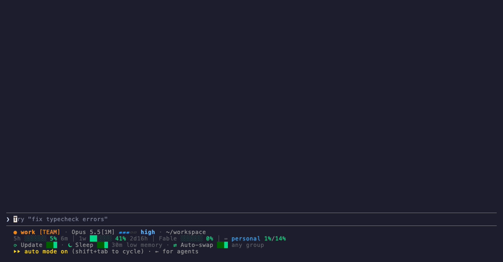
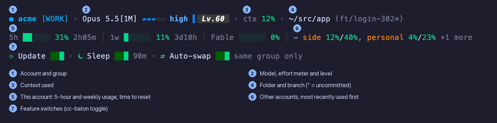

<div align="center">


# cc-baton

**Move a Claude Code conversation between your own accounts, full transcript included.**

[](https://github.com/juunghyun/cc-baton/actions/workflows/ci.yml)
[](LICENSE)
[](#install)

English | [한국어](README.ko.md)

</div>

Your team seat and your personal plan are separate Claude accounts, and a conversation normally stays in the one it started in. Type `/swap personal`, press Ctrl+D, and the same conversation continues on your other account, transcript and all. A statusline HUD shows which account you're on, so work doesn't end up on the wrong one.



## Install

```sh
curl -LsSf https://astral.sh/uv/install.sh | sh          # only if you don't have uv
uv tool install --python 3.12 git+https://github.com/juunghyun/cc-baton && ~/.local/bin/cc-baton install
```

Open a new terminal and run **`baton`**. The first run asks a few questions (language, account groups, HUD, hibernation, auto-swap, usage refresh), then shows the account picker. You need at least one account in [claude-swap](https://github.com/realiti4/claude-swap), which comes bundled: log in to Claude Code and run `cswap add`.

`cc-baton install` never asks anything and is safe to re-run. It backs up `~/.claude/settings.json` before touching it and never replaces a statusline you already have without asking.

<details>
<summary>Installing with an AI agent?</summary>

Run exactly the two lines above (skip the first if `uv --version` works). Don't edit `~/.claude/settings.json` or `~/.zshrc` yourself. Show the user what `cc-baton install` printed and tell them to open a new terminal and run `baton` to finish setup.

</details>

## Why cc-baton

**The whole conversation moves, not a summary.** The transcript file itself is copied to the other account and resumed there, along with its large tool outputs and subagent logs. Your other conversations stay where they were.

**Always know which account you're on.** Three lines under the prompt show the account and its group, each account's usage, and which features are on.



**Hard to swap the wrong way.** Give accounts groups such as `work` and `personal`. Moving a conversation to another group asks you first.

**Idle tabs stop eating memory.** Optional: a session left idle has its Claude Code process stopped (force-stopped if it doesn't exit). Any key resumes the saved conversation; work that was still running when it stopped can be lost. `/sleep` does it right away.

**Ready when an account runs out.** Optional and off by default. When one of your accounts hits its usage limit, cc-baton can prepare a switch to another of your own accounts; you confirm it with Ctrl+D.

## Commands

| Command | What it does |
|---|---|
| `baton` | Pick an account and start Claude Code (`baton work` to name one) |
| `/swap <account>` | Move this conversation to another account, then press Ctrl+D |
| `/sleep` | Hibernate this session now |
| `baton --wake` | Bring back a hibernated session |
| `cc-baton toggle update\|hib\|swap on\|off` | Turn a feature on or off |
| `cc-baton setup` · `lang en\|ko` · `upgrade` | Setup again · display language · update cc-baton |

## Uninstall

```sh
cc-baton uninstall
```

Removes only what cc-baton added and puts back the statusline you had. Your claude-swap account data (`~/.claude-swap-backup`) is never touched.

## Before you use it

- **Your own accounts only.** Sharing an account or its login with anyone else is not allowed under Anthropic's [Consumer Terms](https://www.anthropic.com/legal/consumer-terms).
- **Each account keeps its own limits.** cc-baton only changes which of your accounts Claude Code uses; it doesn't raise or reset any limit. Anthropic says Pro and Max limits assume ordinary, individual use and may enforce its terms without notice. Auto-swap is off by default; read the [Usage Policy](https://www.anthropic.com/legal/aup) and [Claude Code terms](https://code.claude.com/docs/en/legal-and-compliance) before turning it on.
- **Work conversations belong to your organization.** Team and Enterprise seats are covered by your organization's agreement ([Commercial Terms](https://www.anthropic.com/legal/commercial-terms)), under which the organization owns its inputs and outputs. After a move to a personal account, the conversation is handled under the [Consumer Terms](https://www.anthropic.com/legal/consumer-terms), including use for model training unless you opt out. The group check asks before such a move.
- **Logins are stored by claude-swap.** cc-baton itself never reads your tokens, but it installs claude-swap, which keeps a copy of each account's Claude login on this Mac and refreshes it. Anthropic's [Claude Code terms](https://code.claude.com/docs/en/legal-and-compliance) restrict third-party tools that store Claude.ai credentials; read them and decide whether this fits your accounts, especially work seats.
- **Usage numbers are optional.** If you turn on usage refresh in setup, claude-swap asks Anthropic's usage endpoint for each of your accounts in the background. It's off by default.
- cc-baton reads claude-swap's state files and parts of Claude Code that aren't official APIs. Tested with macOS 15.3, Claude Code 2.1.285 and claude-swap 0.25–0.26.

## More


Development: `uv tool install -e . && cc-baton install` from a clone, tests with `uv run --group dev python -m pytest tests -q`.

## Author's note

I work across a team seat and a personal plan every day. Every time a task moved from one account to the other, the conversation stayed behind and I had to explain everything again. cc-baton is the smallest thing I could build that keeps the thread.

cc-baton is an unofficial add-on, not affiliated with or endorsed by Anthropic or claude-swap. Claude and Claude Code are trademarks of Anthropic, PBC. MIT licensed; provided as is, without warranty.
